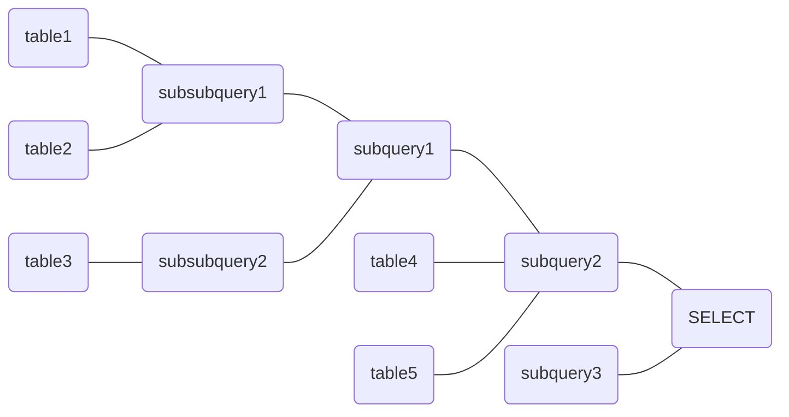

# Module `csv_to_json`

Build an object -> upstream dependencies JSON object from CSV content.

**Parameters**

- \[`str`\]: Path to the CSV file(s).

**Returns**

- \[`str`\]: JSON-formatted, nested list of object and upstream dependencies (objects
  that are depended on).

**Usage**

```shell
$ python script.py <CSV FILE> [<CSV FILE> [...]]
```

**Example**

```shell
$ python script.py dependencies.csv
$ python script.py file1.csv file2.csv file3.csv
```

**Functions**

- [`to_json()`](#csv_to_jsonto_json): Convert the CSV content to JSON.

## Functions

### `csv_to_json.to_json`

```python
to_json(content: str, objects: dict[str, list[str]]) -> tuple[str, list[str]]:
```

Convert the CSV content to JSON.

**Parameters**

- `content` \[`str`\]: The CSV content to parse and convert.
- `objects` \[`dict[str, list[str]]`\]: Dictionary of objects already parsed.

**Returns**

- \[`dict[str, list[str]]`\]: Updated dictionary of objects and upstream dependencies.

**Notes**

Expects a two columns dataset, each line embedding a `object1,object2` pair; the second
object is expected to be depended upon.

# Module `filter_json`

Fetch all objects related to another one, regardless of the depth.

**Parameters**

- \[`str`\]: Name of the object to filter for.
- \[`str`\]: Path to the JSON file(s).

**Returns**

- \[`str`\]: JSON-formatted, nested list of object and upstream dependencies (objects
  that are depended on).

**Usage**

```shell
$ python script.py <OBJECT NAME> <JSON FILE> [<JSON FILE> [...]]
```

**Example**

```shell
$ python script.py fact_thing dependencies.json
$ python script.py dim_whatever file1.json file2.json file3.json
```

**Functions**

- [`filter_json()`](#filter_jsonfilter_json): Fetch all objects related to a single
  object, regardless of the depth.

## Functions

### `filter_json.filter_json`

```python
filter_json(
    name: str,
    objects: dict[str, list[str]],
    _objects: dict[str, list[str]] = {},
) -> dict[str, list[str]]:
```

Fetch all objects related to a single object, regardless of the depth.

**Parameters**

- `name` \[`str`\]: Name of the object to filter for.
- `objects` \[`dict[str, list[str]]`\]: Dictionary of objects and upstream dependencies.
- `_objects` \[`dict[str, list[str]]`\]: Dictionary of objects already parsed.

**Returns**

- \[`dict[str, list[str]]`\]: Filtered list of upstream and downstream dependencies.

# Module `format_json`

Convert a child -> list of parents JSON to `Mermaid` syntax.

**Parameters**

- \[`str`\]: Path to the JSON file(s).

**Returns**

- \[`str`\]: `Mermaid` diagram.

**Usage**

```shell
$ python script.py <JSON FILE> [<JSON FILE> [...]]
```

**Example**

```shell
$ python script.py dependencies.json
$ python script.py file1.json file2.json file3.json
```

**Functions**

- [`to_dot()`](#format_jsonto_dot): Convert the JSON content to `DOT` syntax.
- [`to_mmd()`](#format_jsonto_mmd): Convert the JSON content to `Mermaid` syntax.

## Functions

### `format_json.to_dot`

```python
to_dot(objects: dict[str, list[str]]) -> str:
```

Convert the JSON content to `DOT` syntax.

**Parameters**

- `objects` \[`dict[str, list[str]]`\]: Dictionary of objects and upstream dependencie.

**Returns**

- \[`str`\]: `DOT` diagram.

### `format_json.to_mmd`

```python
to_mmd(objects: dict[str, list[str]]) -> str:
```

Convert the JSON content to `Mermaid` syntax.

**Parameters**

- `objects` \[`dict[str, list[str]]`\]: Dictionary of objects and upstream dependencie.

**Returns**

- \[`str`\]: `Mermaid` diagram.

# Module `sql_to_json`

Extract upstream dependencies from SQL files, each containing a single query.

**Parameters**

- \[`str`\]: Path to the SQL script(s), each containing a _singled out_ SQL query.

**Returns**

- \[`str`\]: JSON-formatted, nested list of objects and associated list of upstream
  dependencies. One can see this object as child -> list of parents.

**Usage**

```shell
$ python script.py <SQL FILE> [<SQL FILE> [...]]
$ python script.py <SQL FILE> [<SQL FILE> [...]] --pretty
```

**Example**

```shell
$ python script.py view.sql --pretty
$ python script.py fact_*.sql dim_*.sql
```

**Note**

- Only a few SQL statements amongst the gazillions ways to write them are supported;
  feel free to drop a message with a new one to test.
- This is based on queries running on `Redshift`, no guarantees this would work on any
  other syntax (but `Redshift` is largely based on `PostgreSQL`, there's hope).
- This little stunt is still in alpha, and a lot more testing is required!

**Functions**

- [`clean_query()`](#sql_to_jsonclean_query): Deep-cleaning of a SQL query via
- [`clean_functions()`](#sql_to_jsonclean_functions): Escape `FROM` operators in SQL
  functions.
- [`split_query()`](#sql_to_jsonsplit_query): Split a query in its subqueries, if any.
- [`fetch_dependencies()`](#sql_to_jsonfetch_dependencies): Fetch upstream dependencies
  from each subquery.

## Functions

### `sql_to_json.clean_query`

```python
clean_query(query: str) -> str:
```

Deep-cleaning of a SQL query via [`sqlparse`](https://github.com/andialbrecht/sqlparse)
and regular expressions.

**Parameters**

- `query` \[`str`\]: The SQL query.

**Returns**

- \[`str`\]: Cleaned up query.

**Notes**

1. `sqlparse` tries to set all supported SQL statements to uppercase.
1. Further cleaning is done via the following regular expressions:
   - `"/\*.*\*/"` -> `""`: remove remaining multiline comments;
   - `"--.*"` -> `""`: remove remaining inline comments;
   - `"([(,)])"` -> `" , "`: single spaces around function parameters;
   - `"([A-Za-z0-9_]+)\s*\.\s*([A-Za-z0-9_]+)"` -> `"[...].[...]"`: remove spaces around
     object descriptors;
   - `"(.*)\s*[<=>]+\s*(.*)"` -> `"[...] = [...]"`: single spaces around equal, greater
     or less than signs (or combinations thereof);
   - `"(.*)\s*\|\|\s*(.*)` -> `"[...] || [...]"`: single spaces around concatenation
     operators;
   - `"(.*)\s*::\s*(.*)"` -> `"[...]::[...]"`: remove spaces around datatyping
     operators;
   - `"[\s]+"` -> `" "`: replace multiple spaces by single spaces;
   - `";$"` -> `""`: remove final semicolumn (`;`).

### `sql_to_json.clean_functions`

```python
clean_functions(query: str) -> str:
```

Escape `FROM` operators in SQL functions.

**Parameters**

- `query` \[`str`\]: The SQL query.

**Returns**

- \[`str`\]: Cleaned up query.

**Notes**

Currently testing for the following regular expression:

- `"(\(\s+['\"].+?['\"]\s+)FROM(\s+\S+?\s+\))"`: match function parameters including
  quoted keywords and the `FROM` keyword,
- `"(\(\s+\S+?\s+)FROM(\s+\S+?\s+\))"`: match function parameters including regular
  unquoted keywords and the `FROM` keyword,
- `"(\(\s+\S+?\s+)FROM(\s+\S+?\s+\()"`: \`\`.

The `FROM` from the matched pattern will be replaced by `%FROM%` not to be matched by
the follow up processing.

### `sql_to_json.split_query`

```python
split_query(query: str) -> dict[str, list[str]]:
```

Split a query in its subqueries, if any.

**Parameters**

- `query` \[`str`\]: The DDL to parse.

**Returns**

- \[`dict[str, list[str]]`\]: Dictionary of \[sub\]queries and associated DDL, split in
  parts if the `union` keyword is found.

**Notes**

Processing goes as follows:

1. Search for `... as ( select ... )` CTE statement via the `[^\s]+\s+AS\s+\(\s+SELECT`
   regular expression.
1. Read each character from there, keeping count of opening/closing brackets; once this
   number reaches zero (or we seeked to end of the query) we are done with the subquery.
1. Store the subquery under the CTE name.
1. Recursively search for new CTE statements within the subquery, if any.
1. Move on to the next subquery.
1. Extract the main query, if any, using the following regular expressions (these could
   be factored a bit further but clarity prevails):
   - `CREATE\s+EXTERNAL\s+TABLE\s+([^\s]+)`
   - `CREATE\s+TABLE\s([^\s]+)`
   - `CREATE\s+MATERIALIZED\s+VIEW\s([^\s]+)`
   - `CREATE\+OR\s+REPLACE\s+VIEW\s([^\s]+)`
   - `CREATE\s+VIEW\s([^\s]+)`

### `sql_to_json.fetch_dependencies`

```python
fetch_dependencies(parts: dict[str, list[str]]) -> dict[str, list[str]]:
```

Fetch upstream dependencies from each subquery.

**Parameters**

- \[`dict[str, list[str]]`\]: Dictionary of \[sub\]queries and associated DDL.

**Returns**

- \[`dict[str, list[str]]`\]: Dictionary of objects and associated list of upstream
  dependencies.

**Notes**

Supported regular expressions (_e.g._, SQL statements):

1. `FROM\s+([^\s(]+)`
1. `JOIN\s+([^\s(]+)`
1. `LOCATION\s+'(s3://.+)'` (`Redshift` stuff)

# Module `test_sql_to_json`

Some test regarding our little SQL parsing.

**Functions**

- [`test_convoluted_query()`](#test_sql_to_jsontest_convoluted_query): Test a convoluted
  query, including subqueries and subsubqueries.
- [`test_create_external_table()`](#test_sql_to_jsontest_create_external_table): Test
  for the `CREATE EXTERNAL TABLE` and `LOCATION` statements.
- [`test_create_materialized_view()`](#test_sql_to_jsontest_create_materialized_view):
  Test for `CREATE MATERIALIZED VIEW` statement.
- [`test_create_table()`](#test_sql_to_jsontest_create_table): Test for `CREATE TABLE`
  statement.
- [`test_create_view()`](#test_sql_to_jsontest_create_view): Test for
  `CREATE [OR REPLACE] VIEW` statements.
- [`test_false_positive_from()`](#test_sql_to_jsontest_false_positive_from): Test the
  exclusion of `..._from` attributes or `FUNCTION(... FROM ...)` clauses.
- [`test_subqueries()`](#test_sql_to_jsontest_subqueries): Test for subqueries (CTE),
  _e.g._, statement including a `WITH` clause.

## Functions

### `test_sql_to_json.test_convoluted_query`

```python
test_convoluted_query():
```

Test a convoluted query, including subqueries and subsubqueries.

The following query contains:

- subqueries defined through `WITH`,
- subqueries within subqueries (...),
- subqueries without `FROM` or `JOIN`,
- a function including the `FROM` keyword,
- `FROM`, `JOIN`, `UNION`.

```sql
with
  subquery1 as (
    select
      attr1,
      attr2
    from (
      with
        subsubquery1 as (
          select
            t1.attr1,
            t2.attr2
          from table1 t1
          inner join table2 t2
          on t1.attr = t2.attr
        ),
        subsubquery2 as (
          select
            attr1,
            attr2
          from table3
        )
      select * from subsubquery1
      union all
      select * from subsubquery2
    )
    where attr1 <> 0
      and attr2 is not null
  ),
  subquery2 (
    select
      s1.*,
      t4.*
    from table4 t4
    left outer join subquery1 s1
    on t4.attr1 = s1.attr1 and t4.attr2 > 0
    inner join table5 t5
    on t4.attr1 = t5.attr1
    where t5.attr is not null
  ),
  subquery3 as (
    select
      trim('"' from attr1) as attr1,
      '2' as attr2
  )
select
  s2.attr1,
  s2.attr2
from subquery2 s2
cross join subquery3 s3
```

Below the query diagram:



Note the final `SELECT` statement is indicated as a node in itself, despite not being an
object.

### `test_sql_to_json.test_create_external_table`

```python
test_create_external_table():
```

Test for the `CREATE EXTERNAL TABLE` and `LOCATION` statements.

```sql
create external table external_table (
  attr1 timestamp,
  attr2 varchar(32),
  attr3 smallint
)
ROW FORMAT SERDE 'org.apache.hadoop.hive.ql.io.parquet.serde.ParquetHiveSerDe'
STORED AS INPUTFORMAT 'org.apache.hadoop.hive.ql.io.SymlinkTextInputFormat'
OUTPUTFORMAT 'org.apache.hadoop.hive.ql.io.HiveIgnoreKeyTextOutputFormat'
LOCATION 's3://bucket/key/_symlink_format_manifest';
```

### `test_sql_to_json.test_create_materialized_view`

```python
test_create_materialized_view():
```

Test for `CREATE MATERIALIZED VIEW` statement.

```sql
create materialized view materialized_view as (select * from external_table)
```

```sql
create materialized view materialized_view
backup no diststyle key distkey (attr) sortkey (attr1, attr2) as
select * from external_table;
```

### `test_sql_to_json.test_create_table`

```python
test_create_table():
```

Test for `CREATE TABLE` statement.

```sql
create table table2 as select * from table1
```

### `test_sql_to_json.test_create_view`

```python
test_create_view():
```

Test for `CREATE [OR REPLACE] VIEW` statements.

```sql
create or replace view simple_view as select * from static_table
```

```sql
create view simple_view as select * from static_table
```

### `test_sql_to_json.test_false_positive_from`

```python
test_false_positive_from():
```

Test the exclusion of `..._from` attributes or `FUNCTION(... FROM ...)` clauses.

```sql
select * from table t
right join valid_from vf
on t.attr = vf.attr and extract(month from vf.datetime) > 6
```

```sql
select
  extract(year from datetime),
  extract(month from to_timestamp(trim('"' from string), 'YYYY-MM-DD HH:MI:SS.FF'))
from table
```

### `test_sql_to_json.test_subqueries`

```python
test_subqueries():
```

Test for subqueries (CTE), _e.g._, statement including a `WITH` clause.

```sql
with
  subquery1 as (
    select
      t1.attr1,
      t2.attr2
    from table1 t1
    inner join table2 t2
    on t1.attr = t2.attr
  ),
  subquery2 as (
    select
      attr1,
      attr2
    from table3
  )
select * from subquery1 s1
left join (select * from subquery2) s2
on s1.attr1 = s2.attr1
```
